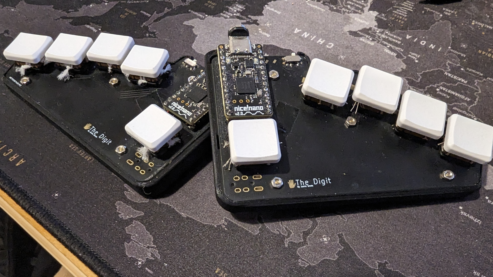

# TheDigit
A chorded keyboard, roughly based on the ginny, the Digit has 5 keys on each side for a total of 10. Inputs not found directly on the keys are accessed with a mixture of layering and chording.

## ZMK 
Zephyr Mechanical Keyboards or ZMK is an open source firmware for keyboards. Within ZMK are a number of useful functionalities that make such a keyboard usable.
- Layering
- Chording
- Tap-dance
- Tap-hold
- Macros

### Layers
Layers allow the user to change the function of the keys they have access to as well as the ability to change the chords they have access to. For example, a number layer could change the main 8 keys to the numbers 1 to 8, with 9 and 0 put as an easy to reach chord. Additional layers can then be added for virtually unlimited functionality.

### Chords
Chords are triggered by pressing two or more keys down at the same time (within a small tolerance). With the available combinations of two keys the user now has more than enough inputs available for the alphabet and the more common punctuation.

### Tap-dance
Tap dancing is the name given to the keyboard behaviour that allows the user to have a key (or chord) behave differently depending on how many times it is pressed within a short window. For example, pressing shift once could give you shift and twice for CAPSLOCK.

### Tap-hold 
Similarly to tap-dance, tap-hold allows the user to trigger different behaviours when they tap a key and when they hold it. For example, pressing ESC for escape and hold it down to activate a layer.

### Macros
Macros are one of the features that really speed up typing and allow the user to properly customise the firmware. A macro can be configured to input sequences of keys, whether they form words or are combinations of modifiers that trigger a frequently used shortcut.

